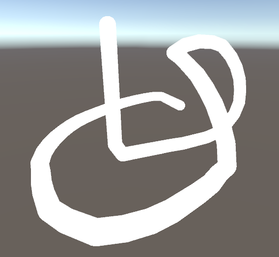
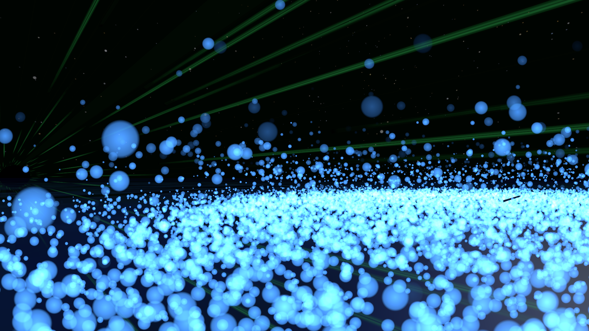
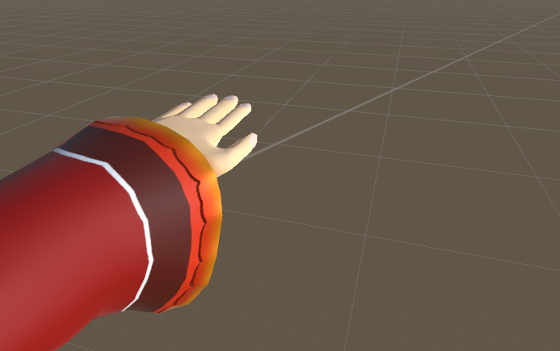
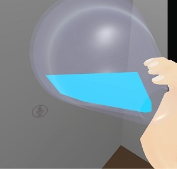

# 配布用諸々 / Storage for distribution

These packages are licensed under CC0.

---

特に確認なども要らないので勝手に使っていただいて結構です

利用は自己責任でお願いします

諸々の著作権などは放棄しているので好きにいじってください

意見などは [Twitter](https://twitter.com/phi16_) にお願いします

- 周期的無限空間の基礎 [infinite\_floor](#infinite_floor)
- 破綻の無いTrail [rounded\_trail](#rounded_trail)
- ふわふわパーティクル [FuwaParticle](#fuwaparticle)
- ローカルチェック [ownerChecker](#ownerchecker)
- まともな方の長い棒 [hand\_pointer](#hand_pointer)
- 全天球カメラ [SphereCam](#spherecam)
- 傾く水 [tilted\_drink](#tilted_drink)

snakeとpascalとcamlが混ざってるのは半分わざと

## infinite\_floor

[infinite\_floor.unitypackage](https://github.com/phi16/VRC_storage/raw/master/infinite_floor.unitypackage)

[Stair Hall](https://twitter.com/phi16_/status/1124367556901392384) の基本機構です。

このまま何かに使うとかではなく仕組み把握用のpackageなので気になる人が居たらというやつです。

一応このテスト空間自体もアップロードしてあるので[ここ](https://www.vrchat.net/home/world/wrld_58171b45-7161-47b7-9834-fbb2462855b2)から自由に見てみてください。

### 使い方

- VRCSDK と StandardAssets/Utility を入れた状態でimportしてください
  - FollowTargetのため
- scene.unity を開くと機構が置いてあるシーンが出てくるはずです

### メモ

実際に使われているものとは異なる部分が多々あります

- 今はPlayerLocalレイヤーで判定で取っていますがToybox/PlayerTrackingで取ったほうがいいという話もあります
- 大量のポリゴンを含むメッシュをSkinnedMeshRendererで描画するとめちゃ重いです
  - 実際にはScaleをめちゃでかくすることで物理的にBoundsを広げています
    - シェーダでScaleを戻してます
- うまく行かなくて困ったりしたら頑張って対処してください (雑)
  - 私がわかりそうな内容なら答えるとは思いますが

### わかりにくそうなところ

- 物体を確実に移動させる方法
  - FollowTargetを循環させる (ウケる)
  - 片側のOffsetで位置を指定する
- コライダーの移動挙動について
  - まず中心を動かす
    - 必ずプレイヤーが載っていないので安全
  - 外側を消すことで、プレイヤーが中心のコライダーに必ず乗ることを保証させる (そのためにすこし時間を置く)
  - 外側を移動する
    - もしもプレイヤーが外側のコライダーに乗っていると引きずられるので
- リスポーン時の挙動
  - まずSpawnBaseがあるので落ちない
  - RespawnColliderが反応、AnimationTrigger
  - そこからuGUI経由で2つのSceneResetPositionを叩く

## rounded\_trail

[rounded\_trail.unitypackage](https://github.com/phi16/VRC_storage/raw/master/rounded_trail.unitypackage)

lineJoinとlineCapが常にroundな、破綻の無いTrail用シェーダ

めちゃくちゃ近いと円が見えてしまいますが、まぁ許してほしい (ちゃんと計算すれば治るかもしれない)

### 使い方

`rounded_trail_sample.prefab` を見てください

- `Trail Renderer` における `Width` は **常に0** にすること
- 色は `Trail Renderer` ではなくMaterialの `Color` の値を読みます
  - だからグラデーション機能とかは使えません (怠惰)
- 未検証ですが [Snail's Marker](https://github.com/theepicsnail/Marker) と互換性がある気がする
  - `Ink` Material のシェーダをコレに変えればいいはず
  - もしもその目的で使った人が居たら情報ください (おかしい or うまくうごく)
- あまり深く考えて作ってないので想定外の挙動をしてたら言ってください
  - デフォルトだと1フレームで1m動くとトレイルが消える
  - まぁペン用ならこれでいいんじゃない？
  - そういえばOrthogonal Cameraから見ると太さが違う (けど知らん)

### 原理

- billboardを自分で作った
- 端点に円をgeometry shaderで生成

## FuwaParticle

 at butadiene's "Twinkle of star" world

[FuwaParticle.unitypackage](https://github.com/phi16/VRC_storage/raw/master/FuwaParticle.unitypackage)

エモいやつ

### 使い方

- FuwaParticle/fuwa\_particle.prefab を出す
    - TransformのScaleやRotationは全く影響を与えません
    - そのうちなおすかも → なおりました
- Materialのパラメータをいい感じにいじる
    - もっと弄りたければシェーダを弄ってください

### 原理

- **G P U パ ー テ ィ ク ル**

## ownerChecker

[ownerChecker.unitypackage](https://github.com/phi16/VRC_storage/raw/master/ownerChecker.unitypackage)

「自分だけに見えるもの」を作るための道具

ほぼ自分用

### 使い方

- Avatarの好きなところに適当にownerChecker.prefabを仕込む (一番外側でよし)
- 他人に見えないようにしたいものにはシェーダでオブジェクトを消す
  - 他人であるとき、`tex2Dlod(_Owner,float4(0.5,0.5,0,0)).a < 0.5` になる
- カメラに関する警告を無視してアップロード (ローカルカメラにする)

### 原理

- ローカルカメラなので他人からはRenderTextureが更新されないだけ
- カメラの負荷は最小限にしているつもり (何も映っていない、1x1テクスチャにただ定数を書き込むだけ)

## hand\_pointer

[hand\_pointer.unitypackage](https://github.com/phi16/VRC_storage/raw/master/hand_pointer.unitypackage)

腕から伸びる長い棒 (1polygon扱い)

VRChatのカーソル位置とぴったり合わせると遠くのものを(設定に依っては)簡単につかめるようになる (フォーカス位置がわかる)

**他人のアバターだとサイズが違うので各々でいい感じの位置と回転を見つけてほしい**

### 使い方

- 予めownerCheckerをいれておく (他人から見えないようにするため)
- 手のbone (`hand_L`, `hand_R` とか) に `pointer_L.prefab` や `pointer_R.prefab` を入れる
  - 多分勝手にownerCheckerのテクスチャが割り当てられているはず

### 原理

- 適当に作った三角ポリゴンをとりあえず依代に
- 長い棒の位置を適当に計算して
- シェーダで2polygon生成して出力
- 位置合わせは試行錯誤でやりました (確定的なパラメータがあればください)

* ちなみにカメラには映らないようになってます

## SphereCam

[SphereCam.unitypackage](https://github.com/phi16/VRC_storage/raw/master/SphereCam.unitypackage)

いわゆる全球を表示してくれるカメラみたいなものです 名前は適当でした

> 360°っていうの微妙に好きじゃない (4πsrでは？)

これ単体をAvatarとしてアップロードすれば、Avatar使用中のVRChatの画面がよくある感じの画像になります

Desktopで撮影のみのために使うことを目的としていますが、後述

### 使い方

- SphereCam.prefabを出して、適当に何らかのGameObjectの下位に配置し、位置調整してアップロード
    - これ単体だと位置調整できないですよね
- このカメラの中心部にUnityの視点を近づけると視界ジャックっぽくなりますが、これが正常です
- 何らかのAvatarに仕込む場合は後述

### 注意

- 他人から見える必要ないので某Animator Trickとかはいらないです (というか**しないで**) (邪魔)
    - アップロード時に「カメラはlocalになるよ」警告が出るのが正常
- 解像度は6つのそれっぽい名前のテクスチャのSizeを弄れば良いです (デフォルトが1024x1024)
- 他のAvatarに仕込む場合
    - VRだとどうなるか未知数ですが、多分ひどいことになります (未検証)
        - 暇なときに調べます
    - Desktopだと目辺りにちゃんと配置すれば良いと思いますが、**自分が映ります**
        - これを防ぐには自分を描画しているShaderを弄って消すのが良いと思います
        - 全ての頂点シェーダで `if(abs(UNITY_MATRIX_P[1][1]/UNITY_MATRIX_P[0][0]+1)<0.01)v.vertex=0;` を先頭に追加すると多分消えます
        - 動かなかったら聞いてください (多分シェーダによって対応が変わる)
- The HUB や The Old HUB 、またpost effectがえらい掛かったワールドだと微妙に変なものが映ります
    - 直し方わかる人教えてください (後者はpost effect抜きで物体描画する方法がほしいわけだが)
- そういえばDesktopの解像度が2:1じゃなくてもなんだかYoutubeLiveは大丈夫っぽい？まぁどうにでもなりそう
- メニューのUIがめちゃくちゃ操作しにくいですが、気合があれば大丈夫です

### 原理

- 6つカメラを置いてそれぞれ撮影 (FOV 90)
- シェーダで合成していい感じに張る
    - CubeMapの動的生成ができないので自分でCubeMapのsamplerを書く
- あとカメラが自分自身以外の人には消えることを利用して視界ジャックの範囲を自分だけに留める
- ちなみに自分が映らないようにするのはカメラのアス比が1:1であるかどうかをチェックしています

### Special Thanks

- [雨下カイトさん](https://twitter.com/AmashitaKite)
    - 作れるか聞かれたので作りました
    - ちょっと前のバージョンですが[動画](https://www.youtube.com/watch?v=qJ8BG3TwD5w)も出してくれました
    - もういっこ[動画](https://www.youtube.com/watch?v=_lnaa49uq68)あった
- [坪倉輝明さん](https://twitter.com/kohack_v)
    - カメラの仕組みについて意見交換等しました
    - こちらもこちらで作っていらっしゃる

## tilted\_drink

[tilted\_drink.unitypackage](https://github.com/phi16/VRC_storage/raw/master/tilted_drink.unitypackage)

[tilted\_drink\_v2.unitypackage](https://github.com/phi16/VRC_storage/raw/master/tilted_drink_v2.unitypackage)

傾くと水面を保つ円柱

UpperRadius と LowerRadius が指定できるので円錐台形なら作れます

- V1 は不透明のみ、V2は半透明が使えます

### 使い方

import すると `tilted_drink` フォルダに諸々が追加されます

単純には `tilted_drink` prefab を出して器にいれて、適当に色を弄れば動きます

- 器に完全に注ぎきった状態における上面を円柱の上面に合わせてください
  - 飲料の量は Material の `Level` で調整してください
- UpperRadius/LowerRadius で円錐台形になら変形できます

詳細 (V1)

- `cylinder.fbx`: デフォルトでとりあえず入れといた円柱
  - これに Shader を合わせているので基本的にはこれを使ったほうがいいような気はします
- `drink_cylinder.shader`: Shader
  - Transparentにしたい場合とかは弄ればいいと思います
  - が、Transparent に出来なかったので Opaque で配布しています
    - めっちゃ傾けたときにポリゴンがばこばこになる
  - 出来た方は教えてくれれば幸いです → V2 で対応しました
- `drink_cylinder.mat`: Material
  - 一種類ならこれを弄ればいいと思いますがそうでもないと思うので
  - 各々でMaterialを作って上の Shader を適用する形になりそうです
- `tilted_drink.prefab`: サンプルです

V2 はなんかいろいろといじって完璧になったバージョンです。

- Color (Surface) が水面の色、Color (Side) が他の部分の色です。半透明も使えます。
- まぁ面倒な人は V1 で十分という感じ

### 注意

**このオブジェクトの XYZ 方向の Scale は必ず一致している必要があります**

- もしも細長い円柱にしたければ UpperRadius/LowerRadius を調整してください
- 皿とかはオブジェクトをめっちゃ小さくして Radius を上げればいいと思います
  - っておもったけどBoundsが変わるから変な挙動になる気がしてきた
  - まぁ Radius は 0 以上 1 以下がいいです
- UpperRadiusとLowerRadiusが一致しない場合、水面が抜けます
  - 指を突っ込まなければわからない (色が定数なので) のでとりあえずは気にしないことに
  - そのうちupdateする気がします → V2 で対応しました

### 原理

- `unity_ObjectToWorld` から回転行列を拾う
- 同時に determinant から Scale 値を拾う
  - この際に XYZ 方向の Scale が一定という条件を課している
- 水面の座標と最も低い位置の座標が計算できる
- 円柱の上面の頂点を UpperRadius を適用しつつ水面位置に移動
- 下面に LowerRadius を適用
- あとはぽいぽい

V2

- まず頂点シェーダをやめる
- Back に Stencil で +1
- Front に Stencil で -1、そして Color (Side) で描画
- Stencil が 1 になっている部分を Color (Surface) で描画
  - しつつ、水面のdepthを計算して直接書き込み

